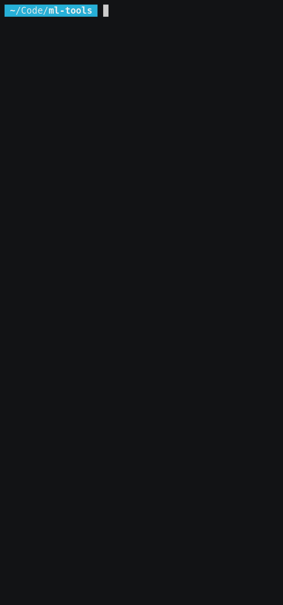

# ml-tools

By Alkin Kaz, Sam Liang, Matthew Coleman

## Simple, Task-Agnostic, High Performance, Dataset Sampling

Datasets often follow some heirarchical structure, with nested folders in a tree-like data structure. By specifying *how* to sample images at each level of the tree, ml-tools allows you to spend less time worrying about your dataset configuration and more time working on your models.

### Easy Batch Sampling

For example, say you needed to batch two images for each "episode" of training:

<p align='center'><\p>

This is done using the put_samplers() method of the .tree module:
```
dataset = Dataset(path, device)
dataset.tree.put_samplers({
  3: (BatchSampler, lambda x: x, {'batch_size': 2})
})
```
Notice that each dictionary entry taken by put_samplers() looks like the following:
```
[Folder Depth]: ([Sampler Type], [Callback Function], [Sampler Parameters])
```
Where `[Folder Depth]` specifies how deep in the folder tree that the target of the sampling is located (use print(dataset) to examine the dataset structure), `[Sampler Type]` specifies a class that extends the .samplers class `Sampler`, `[Callback Function] specifies a callback function to be used on the sample or batch of data drawn from the next level of the directory tree by the sampler, and `[Sampler Parameters]` specifies any parameters being passed to the sampler.
  
And then dataset iteration is performed with:
```
  for x in dataset:
    > do something with data
```

### Few-Shot Sampling

Or say you needed k batches of n + m sub-batches, taken from specific levels of the directory tree for each episode, creating a few-shot-esque task:

<p align='center'><\p>
  
Likewise, this can be performed with a slight variation to the put_samplers() method:
```
  dataset = Dataset(path, device)
  dataset.tree.put_samplers({
    2: (ParallelSampler, lambda x: x, {'batch_size': 2}),
    3: (BatchSampler, lambda x: x, {'batch_size': 2})
  })
```
